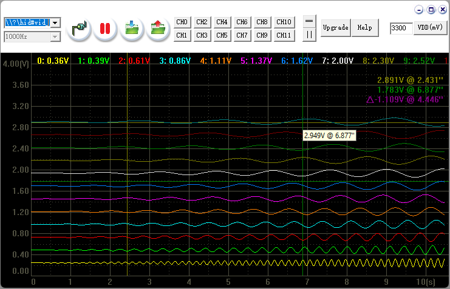
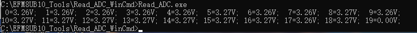

# USBHID-20-channel-ADC-with-Windows-GUI
1. Use EFM8UB10 make a 20-channel low speed oscilloscope.
2. Open source, both hardware and software, hardware can buy from www.taobao.com
3. VOL_monitor.png is screen capture of Vol_Monitor-WinGUI. It supports 12-Channels due to display colors. You can change it freely to make your own new tool.

5. Read_ADC_WinCmd is a Windows command line tool to read ADC data of 20 channels.

   The source code shows to you how easy to make your own software.   
   Of cause you can make a batch file or call from other program to get 20-CH data.

Anything need help, you can mail to gr_li@163.com, or guanrong.li@silabs.com if it's reachable which means I'm still working in Silicon Labs. (^_^)
Uploaded Date: 2025-02-13
